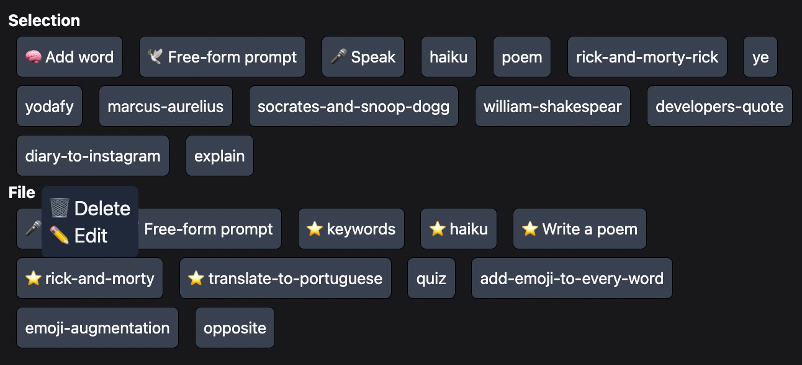

# GPT IDE

The site you're seeing now can be transformed into an IDE if you connect it with an API that you can run locally.

## Set up instructions

### 1) Prerequisites

You need **Chrome** for this tool, please install chrome [here](https://www.google.com/chrome)

You need **Node.js** for this tool, ([windows](https://nodejs.org/en/download/), [MacOS, Linux](https://formulae.brew.sh/formula/node))

You need **`yarn`** for this tool, see installation instructions [here](https://classic.yarnpkg.com/lang/en/docs/install/#mac-stable)

You need **`git`** too! Installation instructions [here](https://git-scm.com/downloads)

Other recommended devtools can be found [here](https://codefromanywhere.com/docs/course/getting-started/installation-instructions) (optional)

### 2) Clone and open it in your code editor

Open a terminal, and clone the repo. You can use [VSCode](https://code.visualstudio.com/)), or simply your terminal if you don't want to change anything.

```
git clone https://github.com/CodeFromAnywhere/gptide
```

### 3) Install

```
yarn
```

### 4) Run

In the repo folder, run:

```
yarn dev
```

This runs the serve on `localhost:42000`. If you now go back to the site, you should be able to see your own file-system! If you don't, make sure you click "API" and ensure `http://localhost:42000` is filled in there. I've only tested on chrome, not sure if other browsers allow this http connection (you might get CORS error).

Alternatively, you can also run the app in `[path-to-repo]/apps/generative-web` using `yarn dev` there. It's the same thing, just locally. You can also build it using `yarn build` and then run the prod version with `yarn start`.

The files are located in `/path/to/your/repo/docs` and you can put anything you want in there, but only `json`, `ts`, `tsx`, `md` extensions are supported, for now. If you don't know markdown, it might be useful to [read up](https://www.markdownguide.org/) on it.

You can now create your own prompts or try executing some of the pre-existing ones.

[VID coming SOON]

_❗️ If you have any issues with the setup, please reach out, I'm trying to make this tool as accessible as possible, and didn't test thoroughly yet on all different environments❗️_

## Prompting

As you can see here, you can do prompts on a file or on a selection within a file.



You can create a new prompt with "Free-form prompt" or you can just use a precreated prompt from the menu.

## Building your own products on top?

Because it's just an API, you can build things with ChatGPT with any techstack. However, I am opinionated, and I recommend Typescript (Node.js, Next.js, and React) because I built a way to build full stack apps with that super quickly (see typerepo.com) and I've started with a course about it (see codefromanywhere.com)

To get started with ChatGPT, there are many ways:

1. Use chat.openai.com manually. Not recommended
2. Use the reverse-engineered API you can find open source on GitHub
3. Use the browser-automation library you can find open source on GitHub

The 3 latter ones can make you get started in a more controlled environment: you can build your own user interfaces on top of ChatGPT with React (or any other framework).

Please DM me on Discord for the most recent links to these GitHub libraries.
